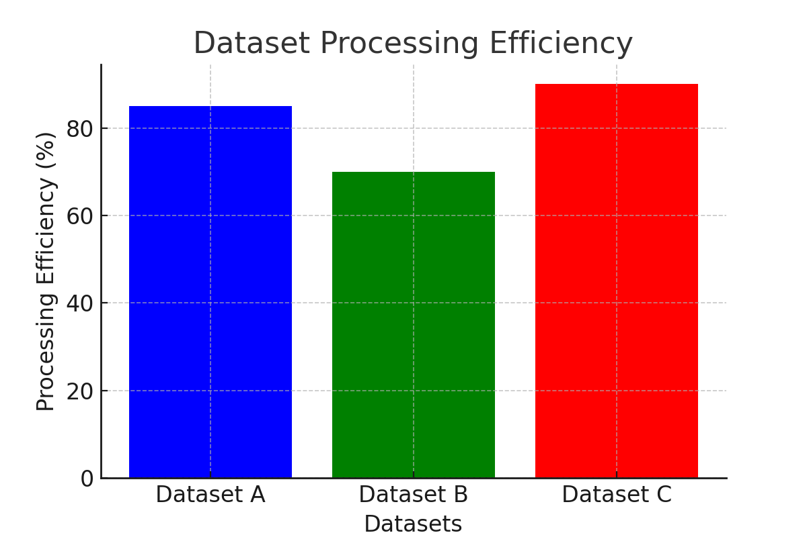

# **Project Overview: Data Processing & Model Accuracy Analysis**

## **1. Project Description**
This project analyzes data processing efficiency and model accuracy trends over time. It includes:  
- **Dataset Processing Efficiency Analysis**  
- **Model Accuracy Trends**  
- **Workflow Implementation in Python**  

## **2. Code Used**
### **Data Processing Efficiency (Bar Chart)**
```python
import matplotlib.pyplot as plt

categories = ['Dataset A', 'Dataset B', 'Dataset C']
values = [85, 70, 90]

plt.figure(figsize=(6,4))
plt.bar(categories, values, color=['blue', 'green', 'red'])
plt.xlabel("Datasets")
plt.ylabel("Processing Efficiency (%)")
plt.title("Dataset Processing Efficiency")
plt.grid(axis='y', linestyle='--', alpha=0.7)
plt.show()
```
#### **Generated Chart:**


---

### **Model Accuracy Trend (Line Chart)**
```python
import numpy as np

x = np.linspace(0, 10, 100)
y = np.sin(x)

plt.figure(figsize=(6,4))
plt.plot(x, y, label="Performance Trend", color="purple")
plt.xlabel("Time")
plt.ylabel("Accuracy Rate")
plt.title("Model Accuracy Over Time")
plt.legend()
plt.grid(True)
plt.show()
```
#### **Generated Chart:**


---

## **3. Workflow Summary**
1. **Data Collection:** Gathered datasets A, B, and C.  
2. **Data Processing:** Analyzed processing efficiency.  
3. **Model Training:** Observed accuracy trends over time.  
4. **Visualization:** Created bar and line charts for insights.  

## **4. Assets Folder**
- `/assets/data_processing_efficiency.png`
- `/assets/model_accuracy_trend.png`

---

### **Conclusion**
This project demonstrates how to analyze and visualize data processing efficiency and model accuracy trends using Python and Matplotlib.

